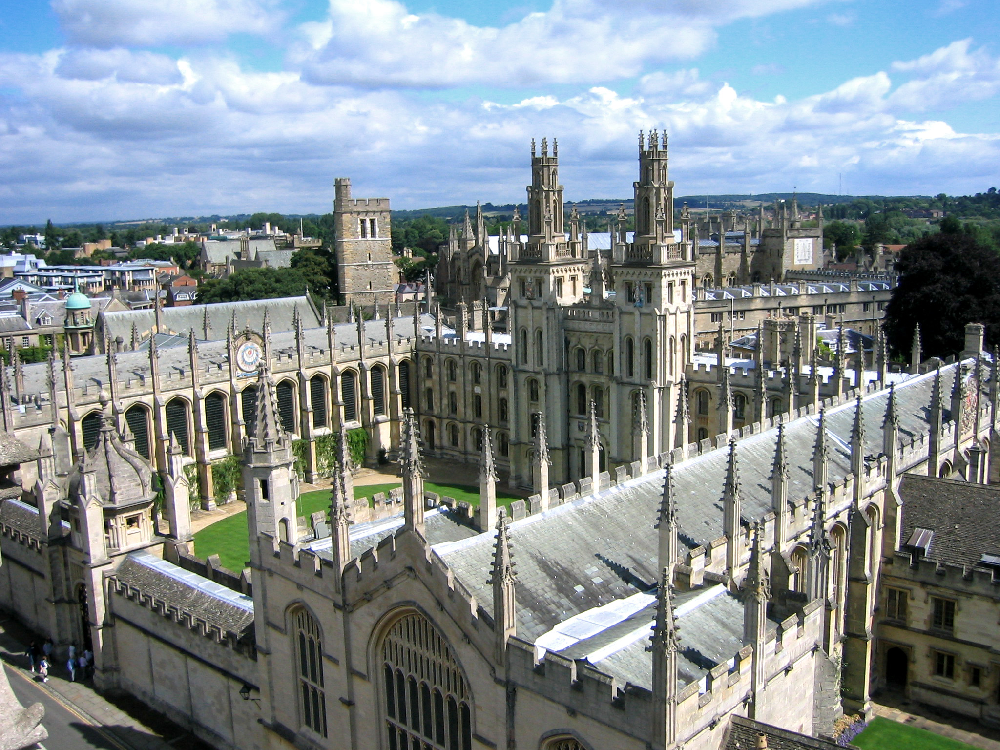

#  My works and wishes
## Success secret  
- **مصاحبه با جناب اقی پارسا:**  
- ایشون بسیار ادم سخت کوشی بودن و گفتن که حتی در دوران دانشجویی شون درس هم میدادن 
- 1 به مواردی که در اینده رشته تان کاربرد دارد توجه کنید  
- 2 برای مدیریت بهتر زمان کارهایتان را اولویت بندی کنید
- 3 از ریسک کردن عاقلانه نترسید
- 4 الگوریتم حل مسائل رو خوب یاد گرفتن 
- 5 در این رشته تقریبا بیشتر دانش مهمه تا مدرک
- 6 یکی دیگه از چیز هایی که من از ایشون یاد گرفتم صبوری در یادگیری مطالب به جای سرسری خوندن مطالب بود و ایشون یکی از عوامل موفقیت خودشون رو همین می دونستن

- Make a plan and do it:
- **Mr samavat** told me to divide my time into **4** parts , which are **lesson**,**rest**,**class**,**sleep** and do my work at 4 to 8 o'clock.
- I have two short-term goals to improve in ***English*** and ***Computer***.
## Its my favorite university
This is ***oxford***:
- In **England**
- The best unniversity.
- this university is first inthe world.
- this university have best descoveries.

[my favorite website](http://www.google.com)
[useful website](http://www.github.io)
I like this **university**:
- I hope to continue my studies at this **Oxford University**

---
**Oxsford**
