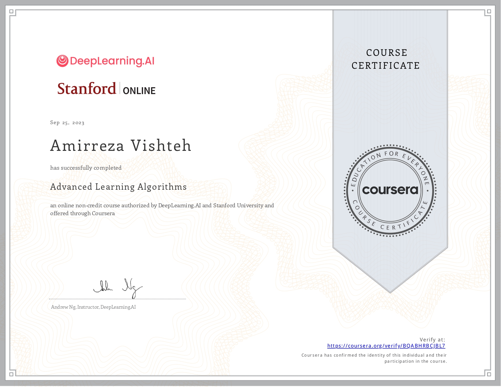
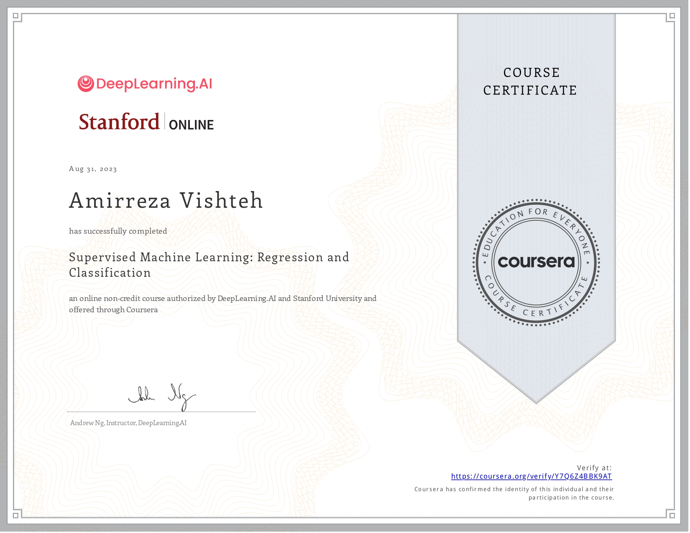
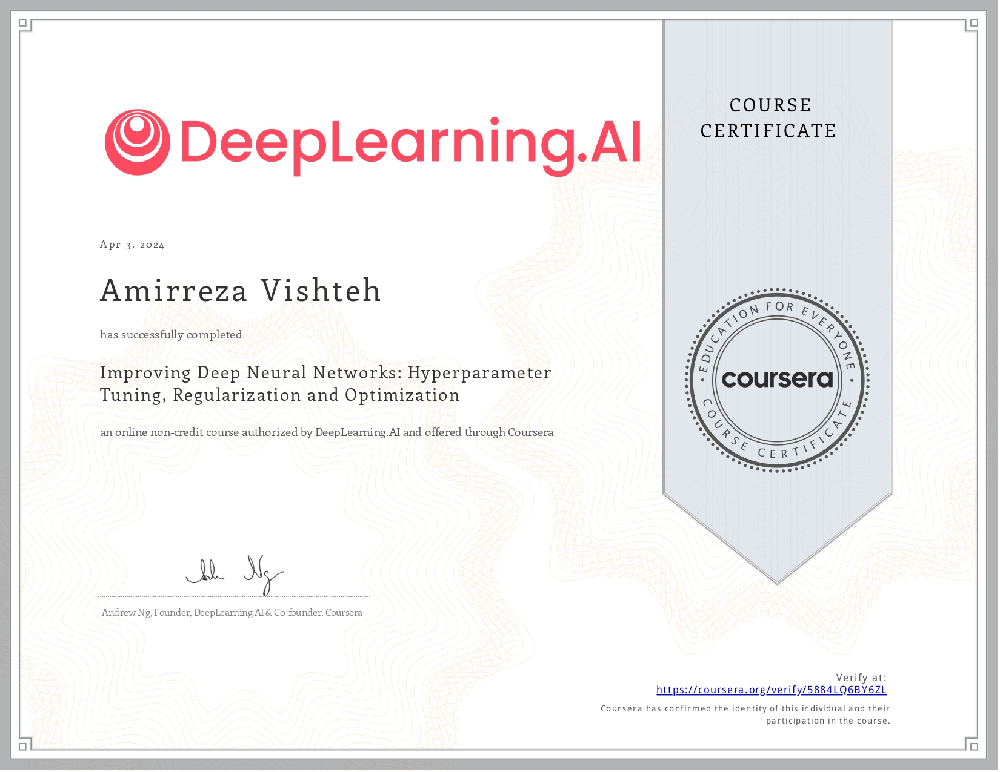

## My Internship at the NLP Lab :

During my internship at the NLP Lab, I had the opportunity to delve deep into the world of Natural Language Processing (NLP). I read six insightful articles that expanded my understanding of this fascinating field. Each article presented a unique perspective on NLP, from its applications in various industries to the latest advancements in the field.

Here are the articles I read:

1. https://arxiv.org/abs/2303.02891
2. https://www.mdpi.com/2504-2289/7/1/35
3. https://arodes.hes-so.ch/record/4525
4. https://ieeexplore.ieee.org/abstract/document/8791893
5. https://www.researchgate.net/publication/358171937_Context-Aware_Emoji_Prediction_Using_Deep_Learning

In addition to reading articles, I also watched several specializations on Coursera. These included courses on Advanced Learning Algorithms, Supervised Machine Learning, Natural Language Processing, and Deep Learning. Each course provided a wealth of knowledge and practical skills that I could apply in my internship.

## Coursera

| Year | Semester | Course | Image |
| ---- | -------- | ------ | ----- |
| 2023 | Fall     | Advanced Learning Algorithm |  |
| 2023 | Fall     | Supervised Machine Learning |  | |
| 2023 | Fall     | Improving Deep Neural Networks: Hyperparameter Tuning, Regularization and Optimization |  |

The combination of theoretical knowledge from the articles and practical skills from the courses allowed me to contribute significantly to the projects at the NLP Lab.
