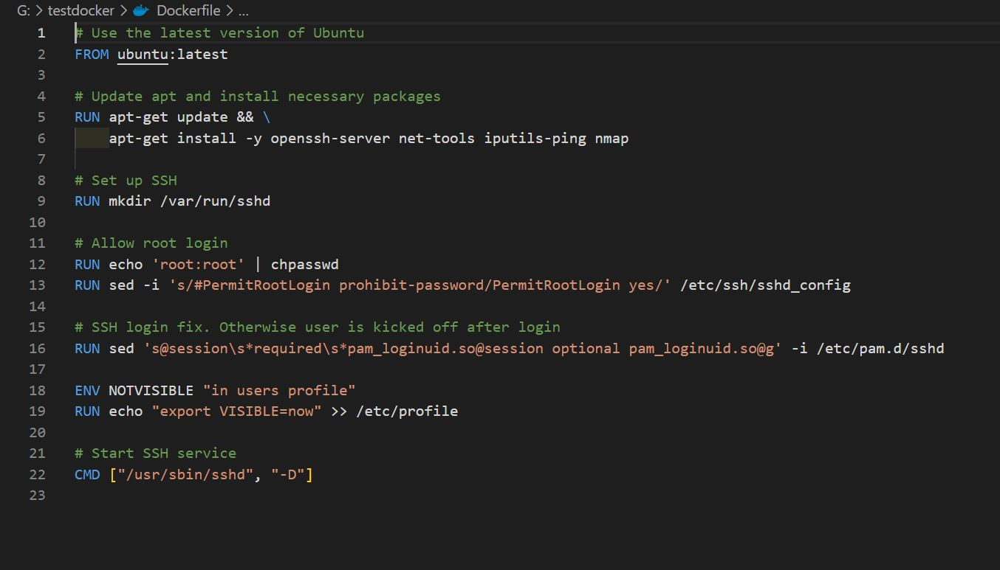
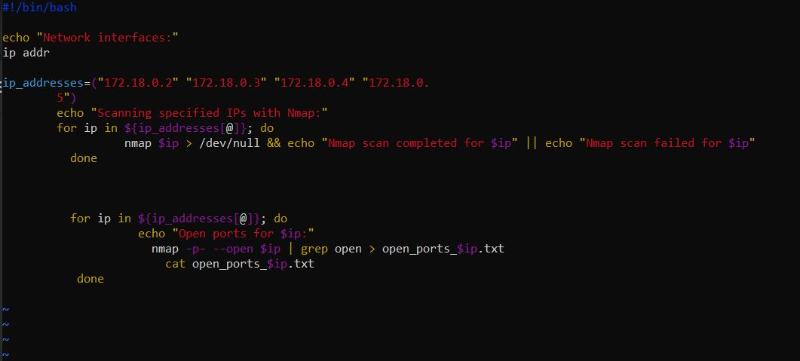
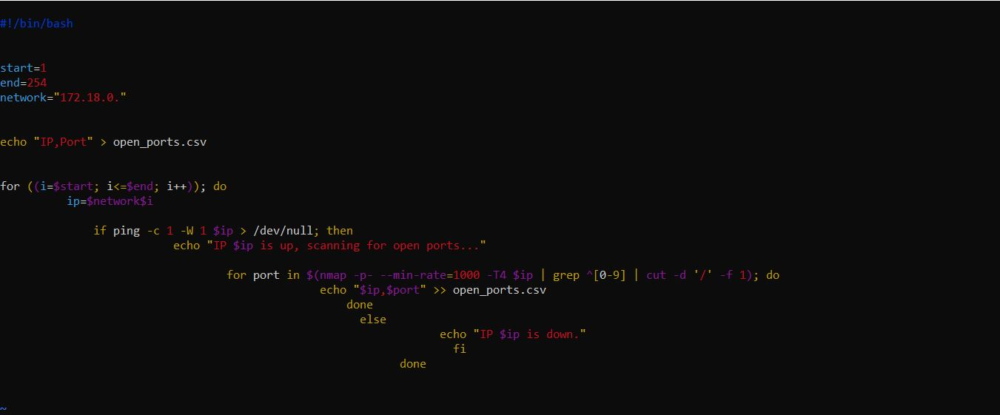
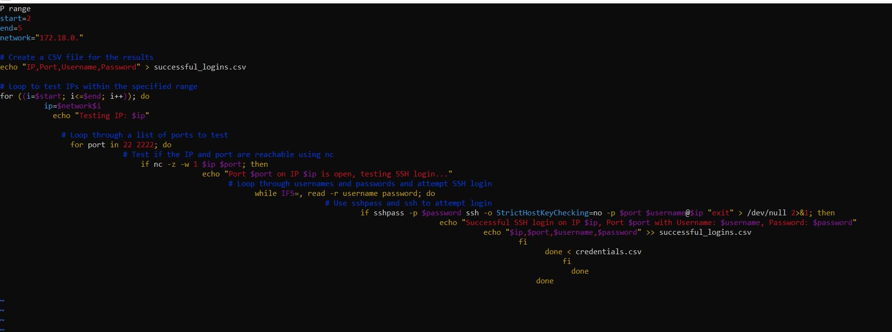
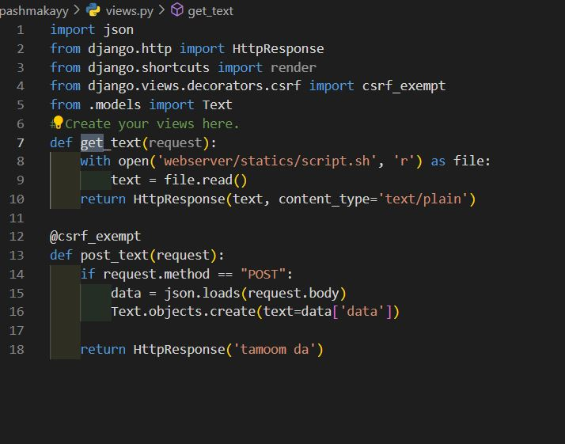
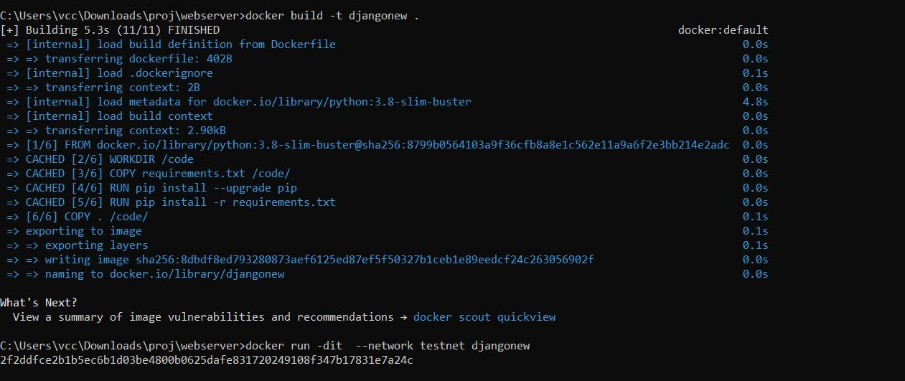

# Project Iridium

**Course Instructor:** Dr. Dianat

**Date:** 1402/08/16

## 1 Introduction
The Iridium project was carried out to create a network simulation using Docker. This network included stations as attackers, victims, and web servers.

## 2 Project Steps
Using Dockerfile, a Docker image was created and the necessary software was installed. Then the following steps were followed in detail:

### 2.1 Step 1
With the use of a script, the open ports of each of the IP addresses present in the code were found.

### 2.2 Step 2
Initially, a script was written to scan the port numbers and store the data. This script scanned the ports from 1 to 254 and if they were open (using nmap), they were added to a sheet.

### 2.3 Step 3
The found devices in the system were tested by a group of common usernames and passwords. The ports were tested and then it was checked whether it was possible to connect to it with a username and password or not.

### 2.4 Step 4
In this step, we first create a Django project to get and give files so that it gives the script file and after collecting data, it returns it to us.

#### 2.5 Step 5
Now we try to enter one of the hosts available in the network with the password obtained in the previous steps and download the file from the server, collect the data and send them to our server to finish the work.

## Crontab Explanation
Crontab stands for "cron table". It is a Linux system file that creates a table-like structure where fields are separated by white space[^1^][1]. Users can populate the table by assigning values to each field (asterisk). The crontab is used to automate all types of tasks on Linux systems[^1^][1]. It provides several alternative options for strong authentication, and it protects communications security and integrity with strong encryption[^2^][9].

## SSH Explanation
SSH, also known as Secure Shell or Secure Socket Shell, is a network protocol that provides administrators with a secure way to access a remote computer[^3^][10]. SSH establishes a cryptographically secured connection between two parties (client and server), authenticating each side to the other, and passing commands and output back and forth[^3^][10].