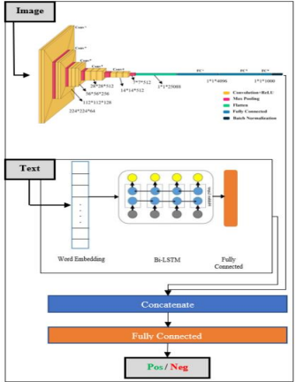
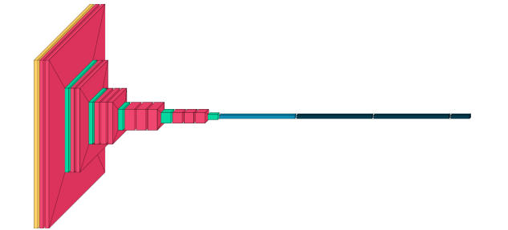
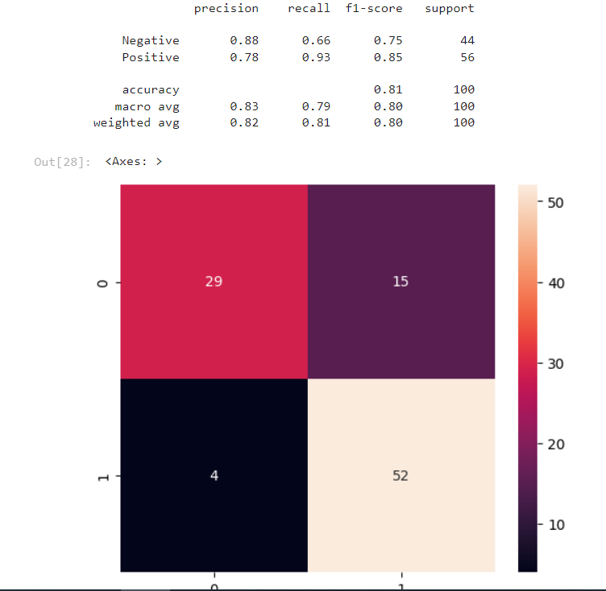

# Multimodal Sentiment Analysis Project(Persian-3classes):

## Overview
In this project, we explore multimodal sentiment analysis, which involves analyzing both text and image data together. Our goal is to predict sentiment labels (positive or negative) based on combined information from text and images.

## Dataset Description
- We obtained a dataset from Instagram that includes both text and image content.
- The dataset consists of 1000 samples, each labeled as either positive or negative sentiment.
- Text data is provided in an Excel file, while image data is stored in a RAR file.

## Model Architecture
Our multimodal sentiment analysis model combines features from both modalities:

- **Image Modality**:
    - We use a pre-trained **16-layer VGG CNN** to extract image features.
     
- **Text Modality**:
    - We employ a **bidirectional LSTM (LSTM-BI)** network to process text data.
- The features extracted from both modalities are concatenated to form a joint representation.

## Results
- Our model achieved an accuracy of **69%** on sentiment prediction.
- Additional performance metrics and findings can be included here.
  

