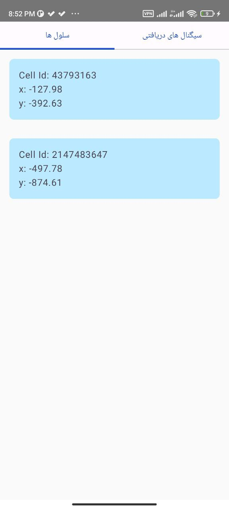
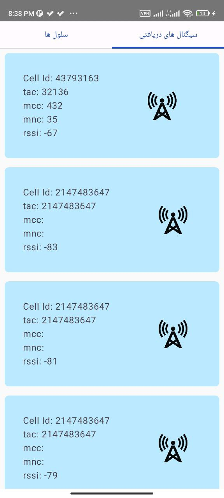

## Overview
In this project, we developed an Android application to estimate the location of cellular network cells using Received Signal Strength Indicator (RSSI) and GPS data. The application collects signal information and utilizes various algorithms for location estimation.

## Team Members
- Amir Reza Veshteh (99521388)
- Mohammad Hossein Rahimi (99521298)
- Mobile Networks Course
- Iran University of Science and Technology
- 6th of July, 2024

## Table of Contents
1. Solution One .................................. 2
2. Solution Two .................................. 4
3. Other Sections ................................ 7

## 1. Solution One
In the first solution, we used RSSI and GPS data to estimate the location of cells in a cellular network. The steps included:
1. **Obtaining Permissions**: Requesting necessary permissions for accessing signal and location data.
2. **Collecting Signal Information**: Gathering cellular signal data including signal strength and identifiers.
3. **Calculating Signal Strength**: Analyzing received signals to determine signal strength from various cells.
4. **Sending and Receiving SMS**: Sending and receiving SMS for communication purposes.

## 2. Solution Two
In the second solution, we used the Circular Lateration algorithm for position estimation. The steps included:
1. **Creating Matrices**: Forming matrices required for circular lateration calculations.
2. **Calculating Position**: Solving linear equations to determine the exact location of the target.

## 3. Other Sections
The utility functions are located in the utils folder. The main program is developed in MainActivity. We continuously gather and process real-time data, displaying the results in two tabs within the application.
## 4.Result in mobile app

