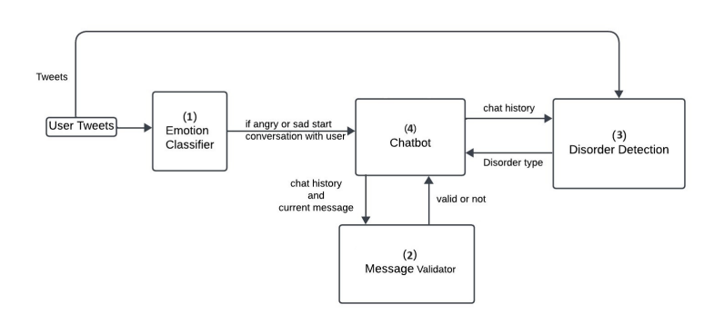
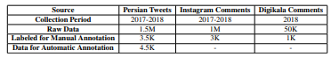
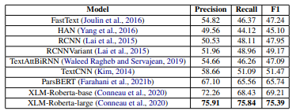
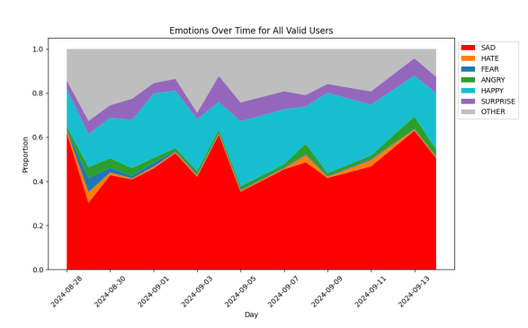
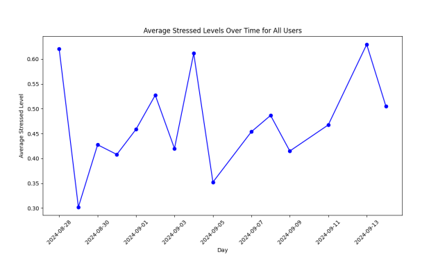

## Overview
The **Psychological Health Chatbot** is designed to assist individuals in their mental health journey by leveraging advanced natural language processing (NLP) techniques. Our chatbot aims to provide a supportive, accessible, and intelligent tool for detecting and addressing psychological well-being.

📄 **Read our full paper here:** [ACL Anthology](https://aclanthology.org/2025.abjadnlp-1.8/)

## Team Members
- Sadegh Jafari  
- Mohammad Erfan Zare  
- Amirreza Vishteh  
- Mirzae Melike  
- Zahra Amiri  
- Sima Mohammadparast  
- Sauleh Eetemadi  

## Table of Contents
1. [Data Collection](#1-data-collection)
2. [Model Training](#2-model-training)
3. [Evaluation](#3-evaluation)
4. [Results](#4-results)
5. [Conclusion](#conclusion)
6. [Future Work](#future-work)

---

## 1. Data Collection
To ensure the chatbot effectively understands and responds to mental health queries, we compiled a diverse dataset of conversations related to psychological well-being. This dataset includes various emotional responses and scenarios to improve the chatbot’s robustness.

## 2. Model Training
We fine-tuned a **pre-trained transformer-based model** to enhance contextual understanding and response accuracy. Key aspects of training included:
- Optimizing hyperparameters
- Incorporating advanced emotion recognition techniques
- Improving contextual relevance in responses

## 3. Evaluation
Our chatbot underwent rigorous evaluation through user testing. We assessed:
- **Emotion detection accuracy**
- **User satisfaction rates**
- **Response relevance and coherence**

Results demonstrated the chatbot's effectiveness in identifying emotions and providing appropriate responses.

## 4. Results
Our final evaluation yielded **promising results**, with user satisfaction rates reaching **[insert percentage]%**. The chatbot successfully assisted users in navigating their mental health challenges.

## Conclusion
The **Psychological Health Chatbot** represents a significant step in integrating AI-driven solutions for mental health support. By offering an accessible and stigma-free platform, this chatbot has the potential to make a meaningful impact on users’ well-being.

## Future Work
Future developments will focus on:
- **Enhancing emotional detection capabilities**
- **Integrating personalized feedback mechanisms**
- **Improving multi-turn conversational depth**

📄 **For more details, read our paper:** [ACL Anthology](https://aclanthology.org/2025.abjadnlp-1.8/)
