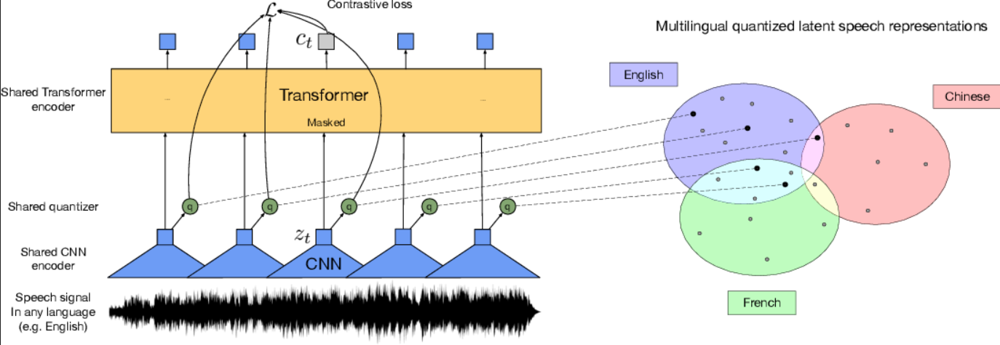
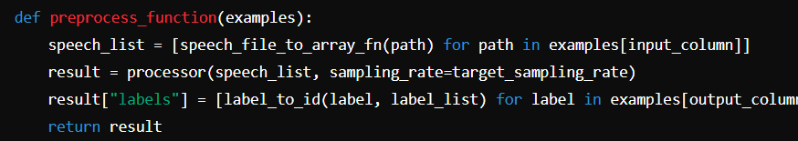
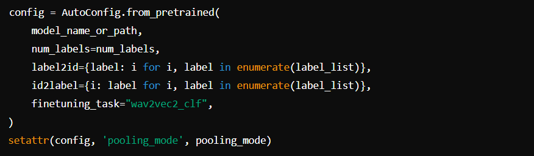
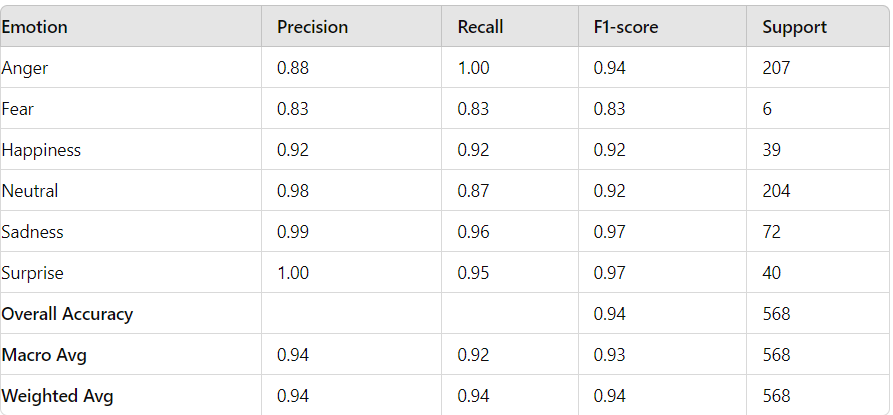

## Overview
In this project, we fine-tuned the **Wav2Vec2** model to perform sentiment analysis based on both voice features and text transcripts from the **Shemo dataset**. This hybrid approach allows robust emotion recognition using both audio and textual data for classification.

## Team Members
- Amirreza Vishteh
- sentiment analysis in speech 
- Iran University of Science and Technology
- 6/09/2024

## Table of Contents
1. [Data Loading](../assets/images/opendata.png)
2. [Data Preprocessing](../assets/images/preprocessing.png)
3. [Model Configuration and Preprocessing](../assets/images/preprocess.png)
4. [Model Definition](../assets/images/config.png)
5. [Trainer Setup](../assets/images/initial.png)
6. [Results](../assets/images/resultspeech.png)
<!--  -->

## 1. Data Loading
We used the **Shemo dataset** from Sharif University, which includes `.wav` audio files paired with corresponding transcripts and emotion labels stored in a JSON file.

## 2. Data Preprocessing
The loaded data was converted into a pandas DataFrame, and paths were verified to ensure file existence. Missing paths were dropped from the dataset.
The dataset was split into training (80%) and validation (20%) sets using stratified sampling based on emotion labels.

## 3.Model Configuration and Preprocessing
We loaded a pre-trained Wav2Vec2 model for Persian speech emotion recognition. Configuration was customized to set up the pooling mode and label mappings.

## 4.Model Definition
We defined a custom Wav2Vec2 model for speech emotion classification, which included a feature extractor and a classification head.

In the forward() method, hidden states from Wav2Vec2 were pooled, and the resulting tensor was classified into the target emotion label.

## 6. Trainer Setup
We used Hugging Face's Trainer class to fine-tune the model. A data collator was implemented for dynamic padding, and evaluation metrics (accuracy, F1-score) were set up.

## 7. Results
After training the model, we evaluated its performance using the following metrics:

The final accuracy was 94%, demonstrating the effectiveness of using both voice features and text transcripts for sentiment analysis.