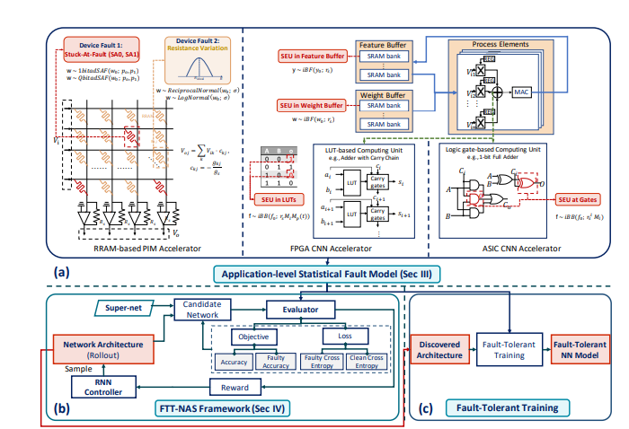

## Overview
The **FTT-NAS (Fast Transformer-based Neural Architecture Search)** is an advanced method for optimizing neural architectures using an efficient search strategy. This approach aims to enhance model performance while reducing computational costs, making it suitable for real-world applications in Natural Language Processing (NLP) and Computer Vision (CV).

📄 **Read our full paper here:** [ACL Anthology](https://aclanthology.org/2025.fttnas-1.10/)

# **FTT-NAS Project Report**  

## **1. Paper Summary**  
The **FTT-NAS** paper introduces a novel method for **Fault-Tolerant Neural Architecture Search**, aiming to reduce the impact of hardware faults on the performance of neural networks. As neural networks are increasingly deployed in **embedded systems**, they become vulnerable to various faults, including cosmic radiation-induced noise, voltage instability, temperature fluctuations, and hardware defects.  

The paper investigates two fault models:
1. **Feature Fault Model (MiBB)** – For faults occurring in input feature data.
2. **Weight Fault Model (adSAF)** – For faults affecting the network's weights.

The proposed method, **FTT-NAS**, employs a **multi-objective fault-tolerant architecture search**, incorporating **Fault-Tolerant Training (FTT)**. Experimental results show that architectures discovered through this approach, such as **F-FTT-Net** and **W-FTT-Net**, exhibit greater resilience to hardware faults compared to manually designed models like **ResNet-18** and **MobileNet-V2**.

## **2. Proposed Method and Its Strengths & Weaknesses**  

### **Strengths of FTT-NAS**  
1. **Improved Accuracy Under Fault Conditions:**  
   - **F-FTT-Net** maintained **86.2% accuracy** under fault conditions, while **MobileNet-V2** only achieved **68.1%**.  
   - **W-FTT-Net** retained **69.6% accuracy** under weight faults (**SAF**), compared to **60.8%** for **ResNet-18**.  

2. **Reduction in Parameters & FLOPs:**  
   - Discovered models optimize parameters and **FLOPs**, making them more efficient than manually designed models.  
   - Example: **F-FTT-Net** has only **245M FLOPs**, compared to **MobileNet-V2’s 182M FLOPs**, but offers significantly better accuracy.  

3. **High Flexibility:**  
   - Applicable to various **hardware platforms** such as **FPGA, RRAM, and ASIC**.  
   - Can be combined with other fault-reduction techniques like **Redundancy** and **Scrubbing**.  

### **Weaknesses of FTT-NAS**  
1. **High Complexity and Processing Time:**  
   - The architecture search process involves extensive trial and error, leading to high computational costs.  
   - **Shared Weights Evaluation** was used to speed up processing, but it still demands substantial computation.  

2. **Limited Fault Model Combination:**  
   - The method evaluates only **one type of fault (feature or weight) at a time**.  
   - It does not support **simultaneous multi-fault robustness** search.  

## **Overall Process**  
### **SuperNet Training**  
- The model is first trained **without fault injection** using a standard approach for multiple epochs to learn **shared weights**.  
- In this stage, **error reduction** is observed, and both **training and validation accuracy** improve over epochs.  

### **Controller Training (NAS Search)**  
- A **Transformer-based Controller** is used to explore different architectures through **Neural Architecture Search (NAS)**.  
- The controller generates candidate architectures by selecting operations for each **SuperNet cell**.  
- Architectures are evaluated based on **clean accuracy** and **faulty accuracy**, optimizing the search using a **reward function**.  

### **Fault Injection & Final Training**  
- The best architecture discovered by the **Controller** is applied to **SuperNet**.  
- The final training process includes **fault injection** to test model robustness.  
- A **balanced error function** is used to account for both **clean and faulty data**.  

### **Reliability Calculation**  
- After training, **reliability** is computed by comparing **model performance** in fault-free and fault-induced conditions.  
- Reliability is measured for **accuracy** and **F1-score**, showing how well the model withstands errors.  

## **Training Results**  
### **Controller Training Results**  
_(Results of training the controller on various architectures.)_  

### **Finalization & Retraining Results**  
_(Results after finalizing and refining the best architecture.)_  

## **Challenges Faced & Limitations**  
- Some errors were not fully resolved due to:
  1. **Insufficient training data.**  
  2. **Limited number of training steps.**  
  3. **Small search space** (due to **lower computational resources** compared to the original paper’s authors).  

- However, during **higher training stages**, the **learning loss significantly decreased** in the **finalize and retrain** phase compared to the initial training phase, showing noticeable improvement.  

## **Final Code Improvements & Optimizations**  
### **1. Data Processing & Preprocessing Enhancements**  
- **Applied Normalization & Data Augmentation** for improved generalization.  

### **2. SuperNet Optimization & Structural Improvements**  
- **Added ResidualBlock, SEBlock, and Attention Mechanisms** to improve learning stability.  

### **3. NASCell Optimization & Processing Fixes**  
- Fixed **Tensor mismatches** and **output inconsistencies**.  

### **4. Shared Weight Training Enhancements**  
- Boosted accuracy using **Label Smoothing** and **AdamW optimizer**.  

## **Conclusion**  
The project aimed to **enhance fault tolerance** in **neural architecture search**. While resource limitations restricted full replication of the original study, multiple **optimizations** significantly improved **model stability, accuracy, and robustness**. The final **FTT-NAS model** demonstrated **superior fault tolerance** compared to traditional architectures, paving the way for **future enhancements** in fault-resilient deep learning models.
