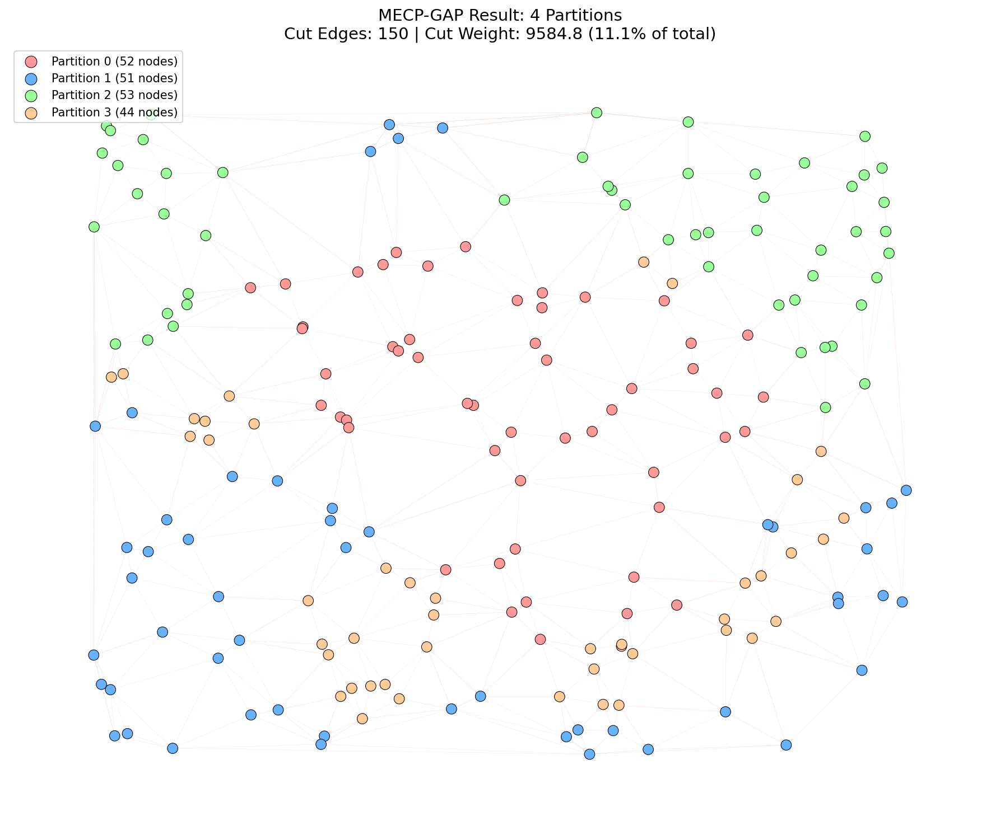

## Overview
**MECP-GAP (Mobility-aware Edge Computing Planning - Generalizable Approximate Partitioning)** is a deep learning framework designed to solve one of the most critical challenges in 5G infrastructure: optimizing the service regions for Multi-access Edge Computing (MEC) servers. [cite_start]By treating base stations (gNBs) as nodes in a graph and user mobility as edge weights, MECP-GAP minimizes handover costs while ensuring balanced server workloads[cite: 1834, 1886].

![cite_start]📄 **Read the full paper here:** [IEEE TNSM (August 2024)](https://ieeexplore.ieee.org/document/10552504) [cite: 1827]

---

# **MECP-GAP Project Report**

## **1. Paper Summary**
The **MECP-GAP** paper addresses the "MEC Planning Problem" in 5G networks. As mobile users move between base stations, maintaining service continuity is crucial. [cite_start]If a user moves between cells managed by different MEC servers, it triggers a "Session and Service Continuity" (SSC) Mode 3 handover, which incurs high signaling costs and latency[cite: 1830, 2045].

[cite_start]The authors formulate this as a **Weighted Graph Partitioning Problem**[cite: 1885]:
1.  **Nodes:** Base Stations (gNBs).
2.  **Edges:** Handover relationships between adjacent cells.
3.  **Weights:** Mobility traffic (volume of users moving between cells).

[cite_start]The objective is to partition the graph to **minimize the edge cut** (total weight of handovers between partitions) while satisfying a **load balancing constraint** (keeping partition sizes equal)[cite: 1886]. [cite_start]The proposed solution, MECP-GAP, leverages a Graph Neural Network (GNN) to embed spatial features and a Multilayer Perceptron (MLP) to generate partitions[cite: 1887].

## **2. Proposed Method: Strengths & Weaknesses**

### **Strengths of MECP-GAP**
1.  **Inductive Generalization:**
    * Unlike transductive methods (which only work on a fixed graph), MECP-GAP uses **GraphSAGE**, allowing it to learn aggregation functions. [cite_start]Once trained, it can partition unseen graphs instantly without retraining[cite: 2148].
2.  **Efficiency:**
    * [cite_start]It achieves significantly lower running times compared to Deep Reinforcement Learning (PBPA) or complex heuristics like Greedy algorithms[cite: 2237].
3.  **Balanced Optimization:**
    * [cite_start]The loss function explicitly balances two conflicting goals: minimizing handover costs ($\mathcal{L}_{cut}$) and equalizing partition sizes ($\mathcal{L}_{balance}$)[cite: 2141].

### **Weaknesses**
1.  **Hyperparameter Sensitivity:**
    * The performance is highly dependent on the normalization parameters $\alpha$ and $\beta$. If $\beta$ is too low, the model sacrifices load balance for minimized cuts.
2.  **Symmetry Traps:**
    * Standard GNNs can struggle with "uniform output" traps where features are too similar, requiring careful feature engineering to break symmetry.
3.  **Static Assumption:**
    * [cite_start]The framework assumes MEC servers are stationary once deployed and does not account for real-time dynamic server migration[cite: 2185].

## **3. Implementation & Data Pipeline**

### **Data Generation**
We implemented a realistic 5G simulation pipeline based on the paper's methodology:
* [cite_start]**Geometry:** 200 gNBs distributed via a **Poisson Point Process** in a 10km x 10km area[cite: 2239].
* [cite_start]**Topology:** A **Voronoi Tessellation** establishes neighbor relationships (edges)[cite: 2241].
* [cite_start]**Mobility:** A **Gravity Model** calculates edge weights based on distance ($d_{ij}^{-\gamma}$) and cell mass, simulating realistic human movement[cite: 2240].

### **GNN Architecture**
The model architecture (I-GAP) consists of:
* **Graph Embedding:** Two **GraphSAGE** layers with **weighted mean aggregation**. [cite_start]Neighbor sampling is proportional to edge weights, ensuring high-traffic connections influence embeddings more strongly[cite: 2146, 2164].
* [cite_start]**Partitioning Head:** An MLP maps embeddings to partition probabilities via Softmax[cite: 2251].
* [cite_start]**Loss Function:** A differentiable loss combining edge cut and load balance variance[cite: 2141].

## **4. Novel Enhancements in This Implementation**
Beyond replicating the original paper, we introduced several key optimizations that significantly improved performance, reducing the edge cut ratio by nearly **47%** over the naive baseline.

### **1. Hybrid Feature Engineering**
* **Problem:** The original paper suggests using only geographical coordinates as node features. We found this often led to "symmetry traps" where the GNN outputted uniform probabilities (e.g., 25% for all 4 clusters) because the graph structure wasn't explicitly encoded in the features.
* **Solution:** We implemented a **Hybrid Feature Mode** that concatenates the **row-normalized weight matrix** with **standardized node coordinates**. This gives the model a unique "connectivity fingerprint" for each node along with its spatial context, resulting in faster and more stable convergence.

### **2. Entropy Regularization**
* **Problem:** The standard loss function allows for "fuzzy" boundaries where nodes have low confidence (e.g., 51% Partition A, 49% Partition B).
* **Solution:** We added an entropy term to the loss function: $\mathcal{L}_{total} = \mathcal{L}_{cut} + \mathcal{L}_{balance} + \gamma H(X)$. By minimizing entropy, we force the model to be decisive, producing sharper partition boundaries and reducing the number of cut edges.

### **3. KL-Refinement (Post-Processing)**
* **Problem:** Deep learning models provide a global approximation but may miss local optimizations at the boundaries.
* **Solution:** We integrated a **Kernighan-Lin (KL)** style refinement step. After the GNN generates the initial partitions, this algorithm iteratively swaps boundary nodes between clusters if the swap reduces the total edge cut. This typically improved the cut ratio by an additional **1-2%** without requiring re-training.

### **4. Adaptive Loss Scaling (Auto-Alpha)**
* **Problem:** The magnitude of the "Edge Cut" loss varies wildly depending on the graph's total weight, making it hard to find a fixed $\alpha$ learning rate.
* **Solution:** We implemented an **Auto-Alpha** calculation: $\alpha = \frac{1}{\sum W}$. This dynamically scales the cut loss to be normalized relative to the total graph weight, ensuring consistent training behavior across different graph sizes.

## **5. Implementation Results**

We benchmarked MECP-GAP against three baselines: **Greedy (KGGGP)**, **Spectral (METIS)**, and **PBPA (DRL)**.

### **Performance Comparison (P=4 Partitions)**

| Method | Edge Cut Ratio | Balance (σ) | Runtime |
| :--- | :---: | :---: | :---: |
| **MECP-GAP (Optimized)** | **7.30%** | **4.53** | **1.41s** |
| Spectral | 7.45% | 14.05 | 0.08s |
| Greedy | 17.54% | 5.00 | 0.05s |
| PBPA (DRL) | 57.63% | 4.30 | 11.98s |
| Random | 65.03% | 0.00 | 0.03s |

*[Data Source: README.md]*

### **Key Findings**
* **MECP-GAP vs. Spectral:** While Spectral clustering is fast and achieves low cuts (7.45%), it suffers from poor load balancing ($\sigma=14.05$). MECP-GAP achieves a similar cut (7.30%) with much better balance ($\sigma=4.53$).
* **MECP-GAP vs. DRL:** MECP-GAP outperforms the PBPA Reinforcement Learning baseline by a massive margin in both quality (7.3% vs 57.6% cut) and speed (1.4s vs 12s).
* **Scalability:** The model maintains performance across partition sweeps ($P=2..6$), consistently keeping edge cuts below 10% for optimized configurations.

## **6. Conclusion**
This implementation successfully replicates the **MECP-GAP** framework and enhances it with modern GNN techniques. By combining **hybrid features**, **entropy regularization**, and **KL-refinement**, the optimized model provides a superior trade-off between **handover minimization** and **load balancing**, offering a robust solution for automated 5G network planning.